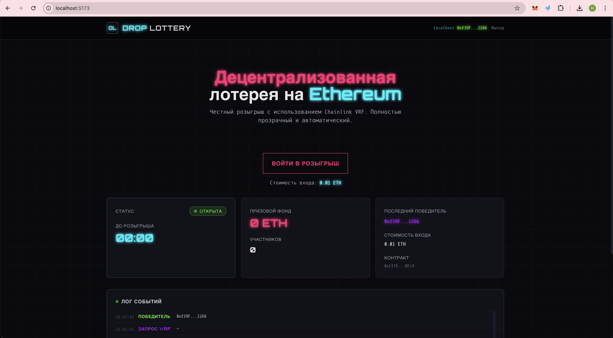

# DROP LOTTERY

DROP LOTTERY — локальная и тестовая Ethereum-лотерея с фронтендом на React и контрактом на Solidity.

## Список технологий

- Solidity `0.8.24`
- Hardhat
- Chainlink VRF v2.5
- Chainlink Automation v2
- Ethers.js v6
- React 18
- TypeScript
- Vite
- Tailwind CSS
- Zustand
- React Router v6
- React Hot Toast

## Памятка по запуску

### 1. Установка зависимостей

```bash
cd HW4/contracts
npm install

cd ../app
npm install
```

### 2. Запуск локальной сети

```bash
cd HW4/contracts
npx hardhat node
```

### 3. Деплой контрактов

```bash
cd HW4/contracts
npm run deploy:local
```

### 4. Запуск фронтенда

```bash
cd HW4/app
npm run dev
```

### 5. Настройка MetaMask

- RPC URL: `http://127.0.0.1:8545`
- Chain ID: `31337`
- Currency Symbol: `ETH`
- Импортируй любой тестовый аккаунт из вывода `npx hardhat node`

### 6. Проверка розыгрыша

- Открой `http://localhost:5173`
- Подключи MetaMask
- Нажми вход в лотерею
- Дождись конца таймера

На `localhost` Chainlink Automation не работает автоматически, поэтому финальный запуск розыгрыша нужно делать вручную:

```bash
cd HW4/contracts
npm run upkeep
```

Если нужно ускорить время:

```bash
cd HW4/contracts
npx hardhat console --network localhost
```

```js
await network.provider.send("evm_increaseTime", [31])
await network.provider.send("evm_mine")
```

## Скриншот стартовой страницы



## REPORT.md

Подробное описание проекта находится в [REPORT.md](./REPORT.md).
