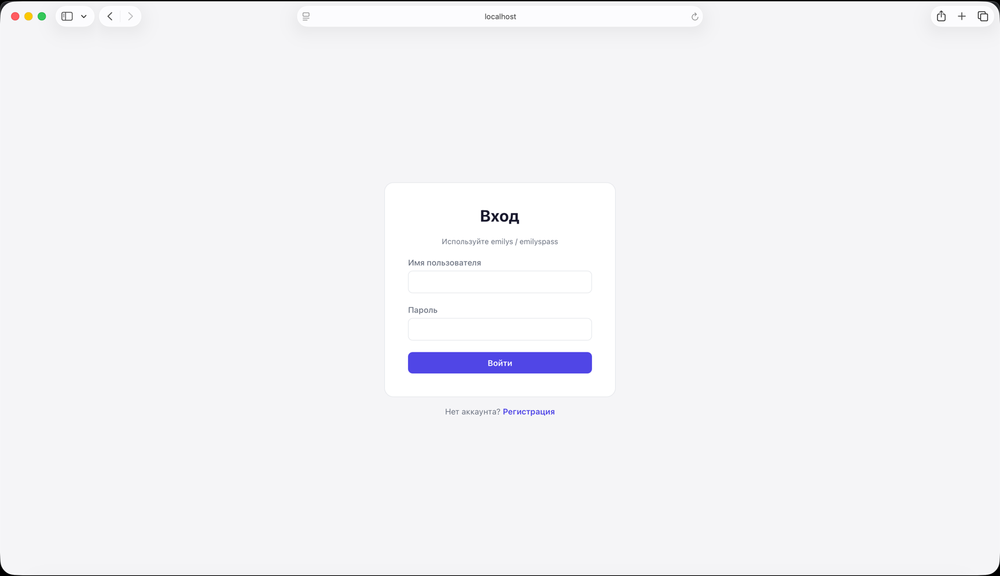
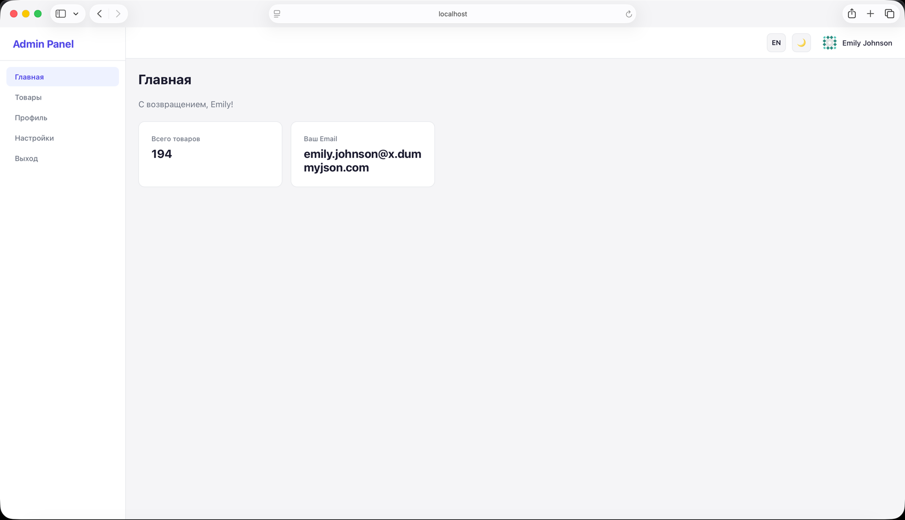
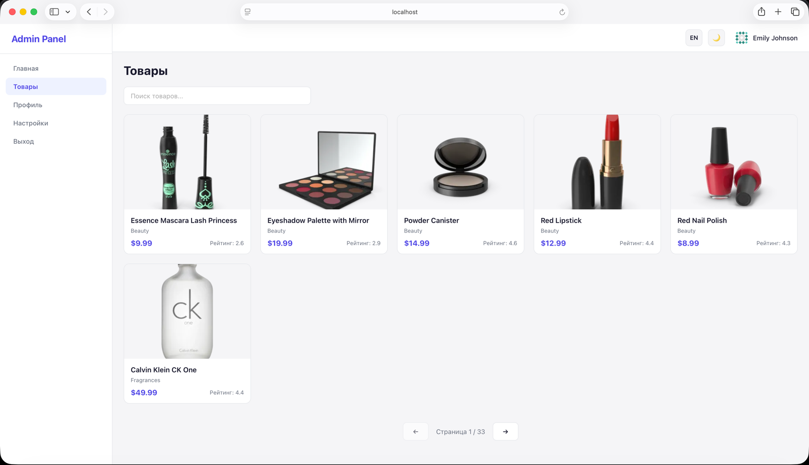
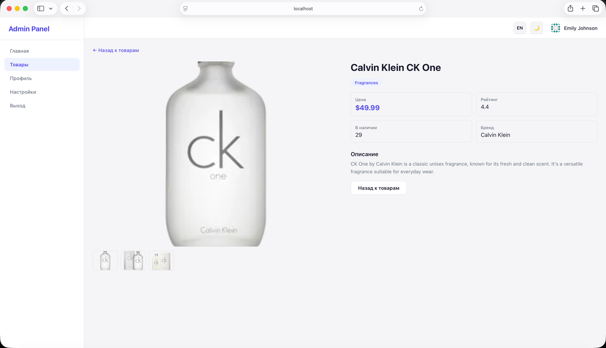
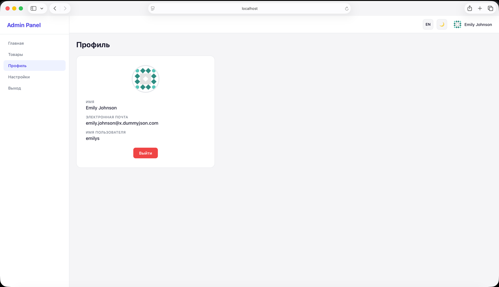
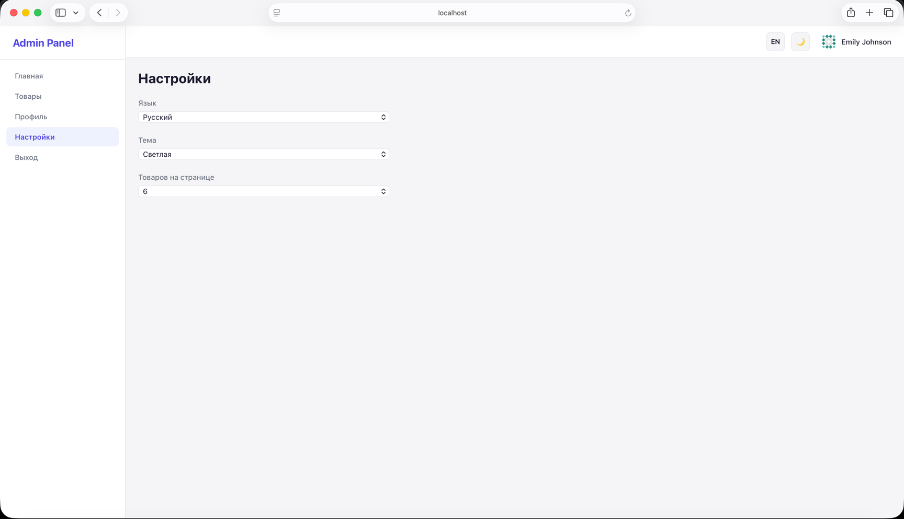
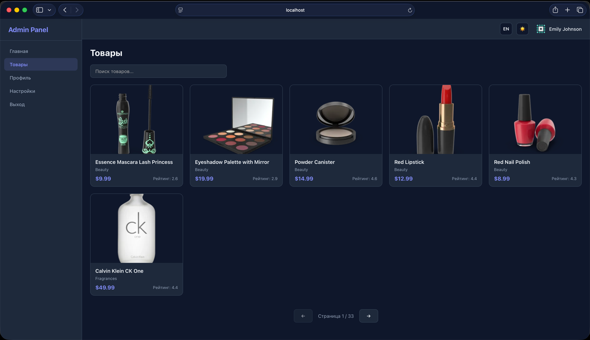
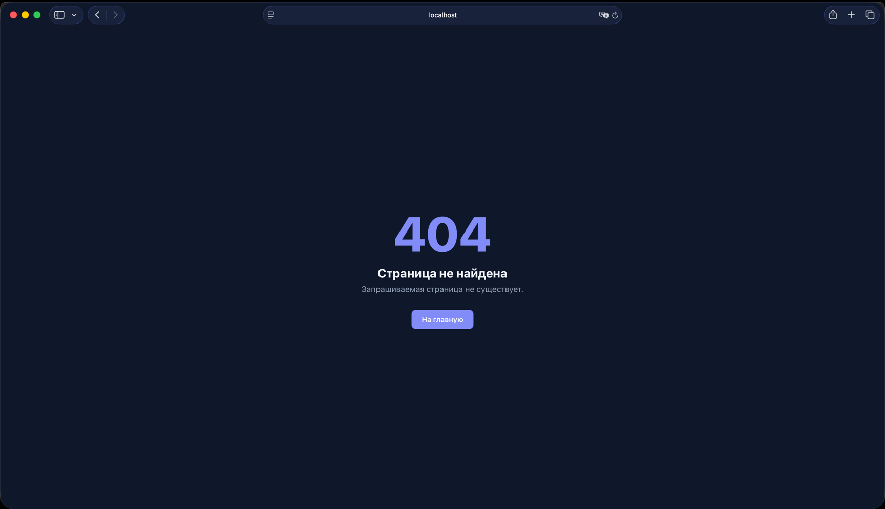

# E-commerce Admin Panel

SPA административная панель для e-commerce системы на React + TypeScript.

## Технологии

- **React 19** + **TypeScript**
- **Redux Toolkit** + **RTK Query** - управление состоянием и работа с API
- **React Router v6** - маршрутизация с lazy loading
- **i18next** + **react-i18next** - локализация (ru / en)
- **CSS Modules** + **CSS Custom Properties** - стилизация и темизация (light / dark)
- **DummyJSON** - backend API

## Архитектура (Feature Sliced Design)

```
src/
├── app/              # Инициализация приложения, провайдеры, роутер, стор
│   ├── router/       # AppRouter, ProtectedRoute, PublicRoute
│   ├── store/        # configureStore, типизированные хуки
│   └── styles/       # CSS-переменные, глобальные стили
│
├── pages/            # Страницы приложения
│   ├── LoginPage/
│   ├── RegisterPage/ # UI-заглушка
│   ├── DashboardPage/
│   ├── ProductsPage/
│   ├── ProductDetailPage/
│   ├── ProfilePage/
│   ├── SettingsPage/
│   ├── LogoutPage/
│   └── NotFoundPage/
│
├── widgets/          # Композитные UI-блоки
│   ├── Layout/       # Sidebar + Header + Outlet
│   ├── Header/       # Шапка с переключателями темы/языка
│   └── Sidebar/      # Навигация
│
├── features/         # Бизнес-логика
│   ├── auth/         # Авторизация (RTK Query + slice)
│   ├── products/     # Каталог продуктов (RTK Query + UI)
│   └── settings/     # Настройки (slice + UI)
│
├── entities/         # Бизнес-сущности
│   ├── user/         # Типы пользователя
│   └── product/      # Типы продукта + ProductCard
│
└── shared/           # Переиспользуемый код
    ├── api/          # baseApi (createApi)
    ├── ui/           # Button, Input, Loader, ErrorMessage, ErrorBoundary
    ├── lib/          # i18n конфигурация + JSON переводы
    └── config/       # Константы
```

## Маршруты

| Маршрут         | Тип       | Описание                                |
|-----------------|-----------|-----------------------------------------|
| `/login`        | Публичный | Страница авторизации                    |
| `/register`     | Публичный | Страница регистрации (заглушка)         |
| `/`             | Приватный | Dashboard                               |
| `/products`     | Приватный | Каталог продуктов                       |
| `/products/:id` | Приватный | Детальная страница продукта             |
| `/profile`      | Приватный | Профиль пользователя                    |
| `/settings`     | Приватный | Настройки (язык, тема, размер страницы) |
| `/logout`       | Приватный | Выход из системы                        |
| `*`             | —         | 404 страница                            |

## Запуск

```bash
npm install
npm start
```

## Учетные данные для входа

API DummyJSON предоставляет тестовых пользователей:

- **Username:** `emilys`
- **Password:** `emilyspass`

## Ключевые сценарии

### Авторизация



### Dashboard



### Каталог продуктов



### Детальная страница продукта



### Профиль


### Настройки


### Темная тема



### Страница 404


